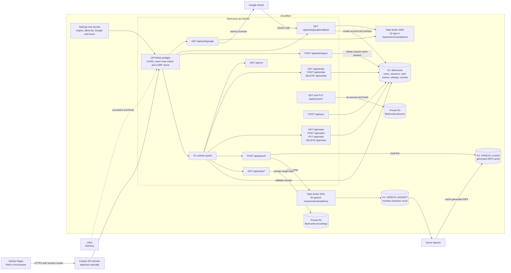

# Infrastructure architecture

This is the current, implemented shape of the online infrastructure. The route
list comes from
[`HTTP_ROUTES`](../api/src/router/dispatch/HttpRoutes.ts); planned deck, lookup,
picture and sync routes are not shown.

## Why the namespaces exist

A Cloudflare KV namespace is an independent key/value store bound to the Worker.
The two namespaces keep unrelated data and lifecycles separate:

| Binding | Kind | Purpose |
| --- | --- | --- |
| `SPEECH_BUDGET` | KV namespace | Holds one character counter per month, so the Worker can stop before it exceeds the Azure Speech allowance. |
| `SPEECH_AUDIO` | KV namespace | Caches generated MP3s by what was spoken and how, so an identical request does not call or charge Azure twice. |

The rate limiters also have namespace IDs, but these are not KV stores. Cloudflare
uses each stable ID as a separate counter space: `2001` counts speech cache
misses (20 per minute per client address), while `2002` counts Google sign-in
starts and callbacks (10 per minute per client address). One kind of traffic can
therefore never consume the other one's allowance.

## Current topology and routes

Alchemy creates or adopts the Worker, D1 database, R2 buckets, KV namespaces and
rate limiters, then binds them to the Worker. The custom domain is deliberately a
manual Cloudflare dashboard step. The R2 bucket has no public address and is kept
when the rest of the Alchemy application is destroyed.

Every route after the session guard returns `401` without a current session. The
logout route is intentionally outside that guard: it succeeds even when there is
no session, and deletes the session from D1 only when the request carries one.
The speech limiter is consulted only after the MP3 cache misses.
